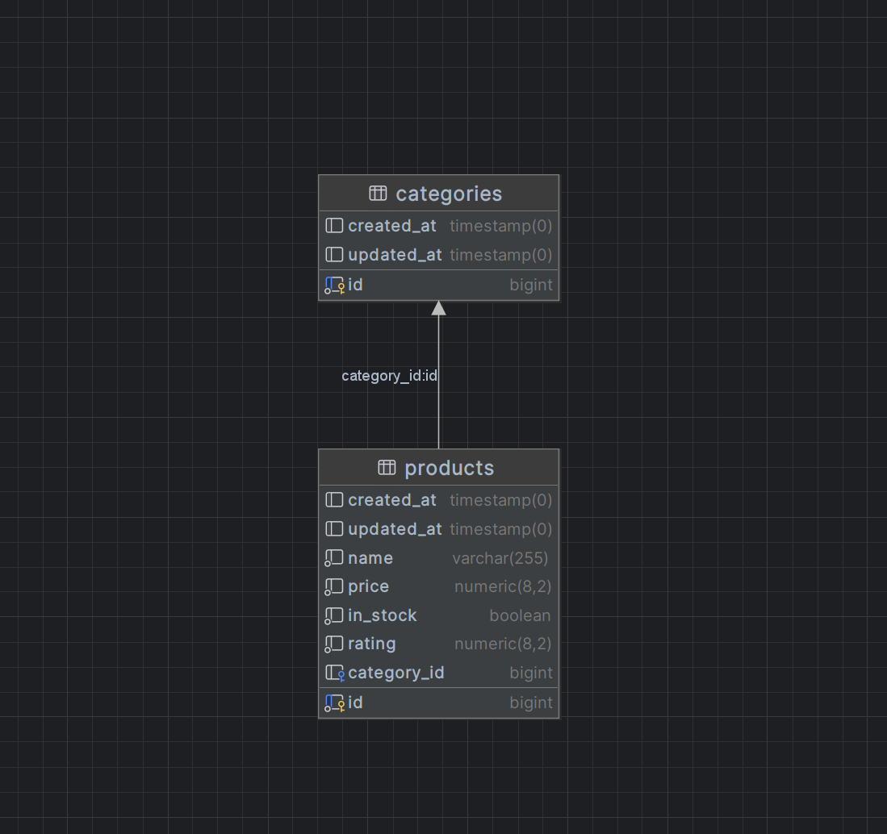
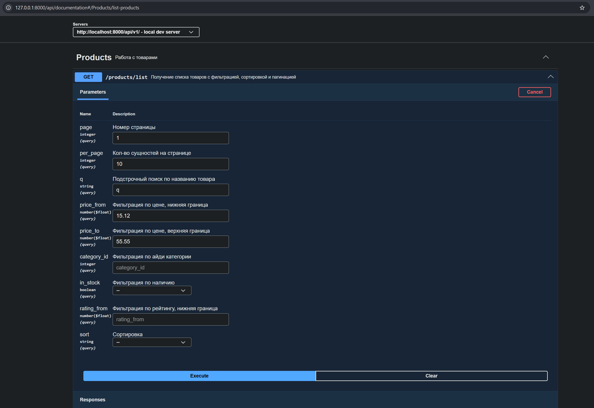

# Веб-сервис для поиска товаров

## Описание

Архитектура:

- Архитектура приложения соответствует рекомендациям Laravel Framework и использует шаблон MVC (Model–View–Controller)
- Бизнес-логика вынесена в отдельный сервисный слой в соответствии с принципом Single Responsibility Principle (SOLID) и практиками разделения слоёв (Layered Architecture)
- Контроллер отвечает за обработку HTTP-запроса, валидацию входных данных, пагинацию и формирование HTTP-ответа, следуя принципу разделения ответственности (Separation of Concerns)

База данных:
- Локально использовался PostgreSQL
- Содержит две основные сущности (помимо вспомогательных сущностей фреймворка): Категории товаров, Товары
- Доступна популяция БД тестовыми данными с помощью отдельных сидеров для каждой ключевой сущности
- Схема БД представлена на диаграмме ниже:

API:
- GET api/v1/products/list - Поиск по товарам
- Документация API доступна по ссылке http://localhost:8000/api/documentation в формате SWAGGER OpenAPI
- Демонстрация спецификации API представлена на изображении ниже:

## Тестирование

Шаги, необходимые для использования сервиса локально:

1. Склонировать данный репозиторий
2. Переименовать .env.example в .env
3. Заполнить необходимые .env переменные (для настройки желаемого подключения к БД)
4. Выполнить команду `composer install`
5. Применить миграции laravel `php artisan migrate`
6. Запустить популяцию базы данных тестовыми данными `php artisan db:seed`
7. Запустить локальный сервер `php artisan serve`
8. Перейти по адресу http://localhost:8000/api/documentation
9. Получить список товаров с нужными параметрами сортировки, пагинации и фильтрации